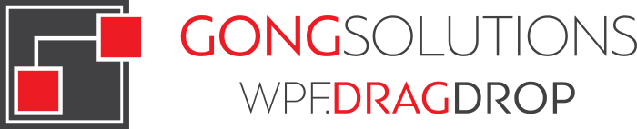
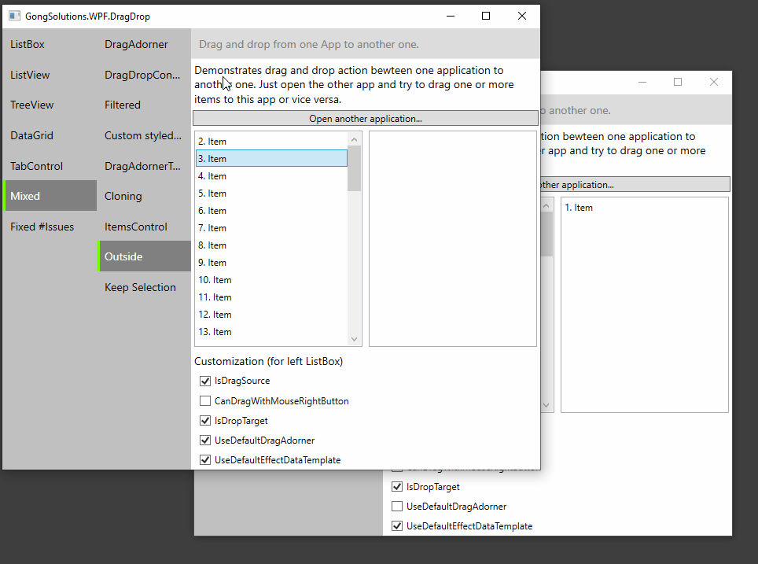
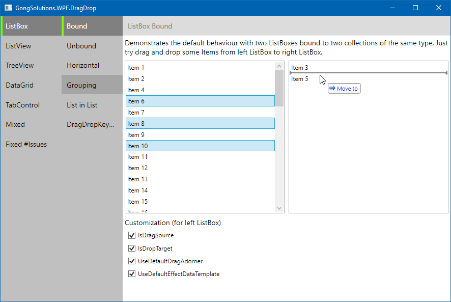
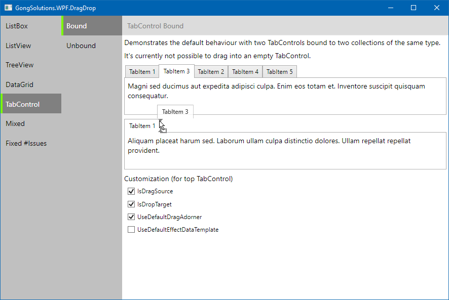
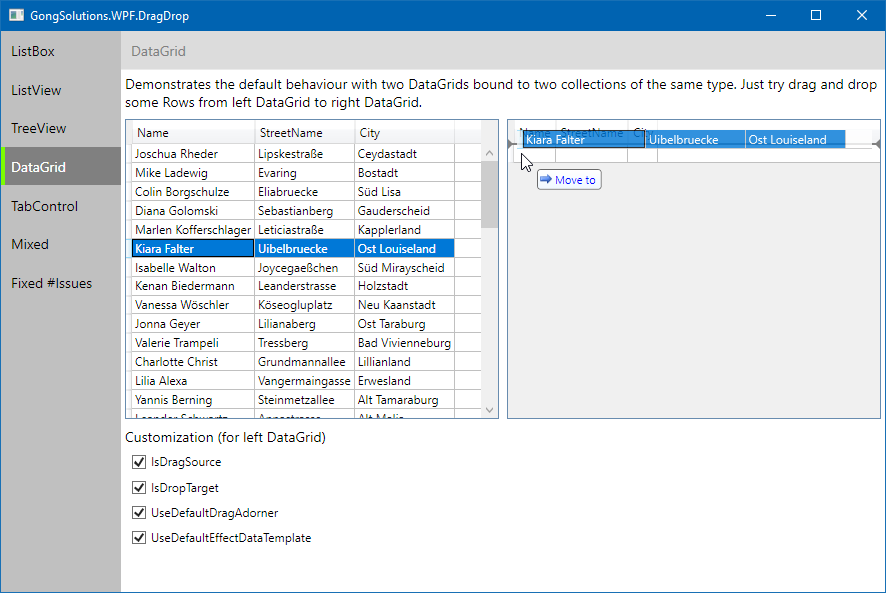
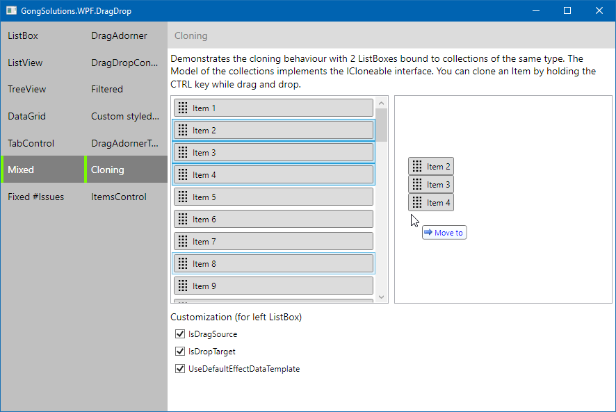
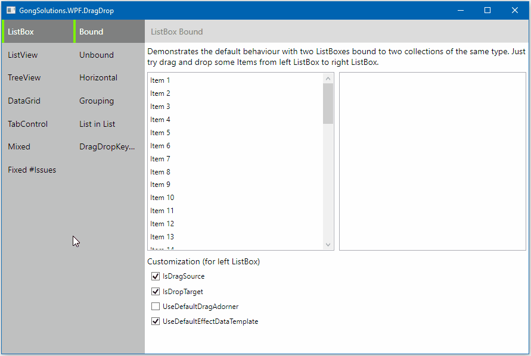
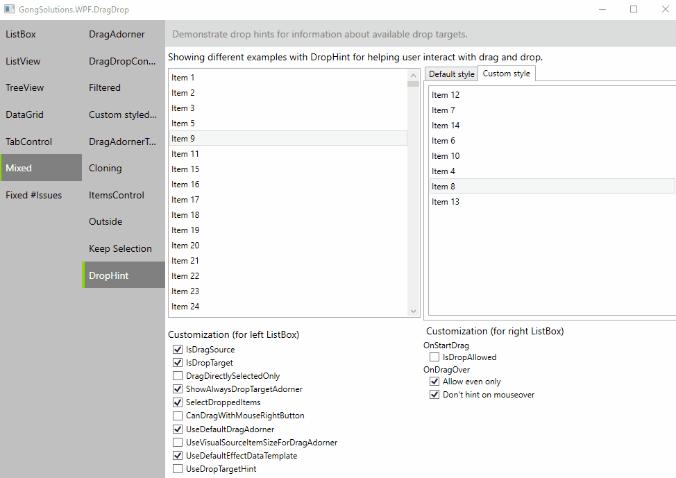

<!-- [](https://vshymanskyy.github.io/StandWithUkraine) -->

<div align="center">
  <br />
  <a href="https://github.com/punker76/gong-wpf-dragdrop">
    
  </a>
  <h1>GongSolutions.Avalonia.DragDrop</h1>
  <p>
    An easy-to-use drag-and-drop framework for Avalonia.
  </p>
  <p>
    Built with Avalonia 12.1.1 and .NET 8.
  </p>

  <a href="https://gitter.im/punker76/gong-wpf-dragdrop">
	  
  </a>
  <a href="https://twitter.com/punker76">
	  
  </a>
  <br />
  <a href="https://ci.appveyor.com/project/punker76/gong-wpf-dragdrop/branch/main">
	  
  </a>
  <a href="https://ci.appveyor.com/project/punker76/gong-wpf-dragdrop/branch/develop">
	  
  </a>
  <a href="https://github.com/punker76/gong-wpf-dragdrop/issues">
    
  </a>
  <br />
  <a href="https://github.com/punker76/gong-wpf-dragdrop/releases/latest">
	  
  </a>
  <a href="https://www.nuget.org/packages/gong-wpf-dragdrop">
    
  </a>
  <a href="https://www.nuget.org/packages/gong-wpf-dragdrop">
    
  </a>
  <a href="https://www.nuget.org/packages/gong-wpf-dragdrop">
    
  </a>
  <br />
  <br />
</div>

## Features

+ Native Avalonia 12 pointer and asynchronous data-transfer APIs.
+ MVVM-friendly attached properties and replaceable drag/drop handlers.
+ Single and multiple selection for `ListBox`.
+ Reorder within a collection or move items between collections.
+ Hold Ctrl while dropping to copy.
+ Optional drag/drop contexts prevent unintended cross-area drops.
+ Runs on every desktop platform supported by Avalonia.

The original WPF implementation remains under `src/GongSolutions.WPF.DragDrop` and
`src/Showcase` as migration reference. The active solution contains only the native
Avalonia projects.

## Get started

```shell
dotnet build src/GongSolutions.Avalonia.DragDrop.sln
dotnet run --project src/Showcase.Avalonia/Showcase.Avalonia.DragDrop.csproj
```

Enable drag and drop in AXAML:

```xml
<ListBox ItemsSource="{Binding Items}"
         dd:DragDrop.IsDragSource="True"
         dd:DragDrop.IsDropTarget="True" />
```

## License

Copyright © Jan Karger, Steven Kirk and Contributors. All rights reserved.

`GongSolutions.Avalonia.DragDrop` is provided as-is under the BSD 3-Clause License. For more information see [LICENSE](./LICENSE).

## Want to say thanks?

This framework is free and can be used for free, open source and commercial applications. It's tested, used and contributed by many awesome people.  So hit the magic :star: button, we appreciate it!!! :pray:

[Become a sponsor](https://github.com/sponsors/punker76) and show your support to this open source project.

If you use `GongSolutions.WPF.DragDrop` as serious task, and you'd like to honor my work on it, please donate, I'll appreciate it.

Does your company use `GongSolutions.WPF.DragDrop`?  Ask your manager or marketing team if your company would be interested in supporting this project.  Your company's logo can be shown [on GitHub](https://github.com/punker76/gong-wpf-dragdrop#readme) - who doesn't want a little extra exposure?

## In action














